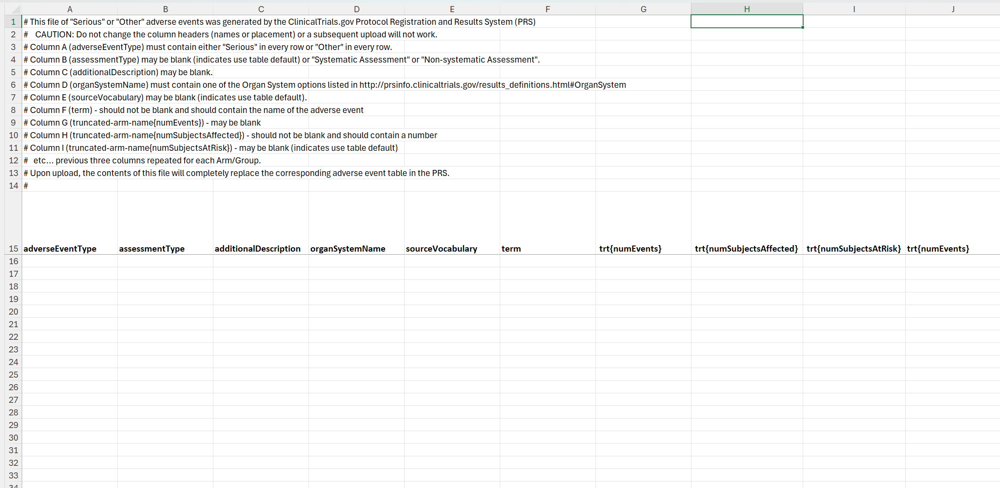
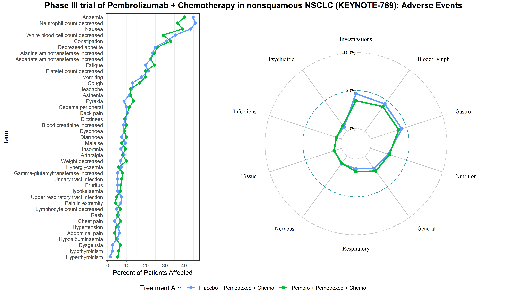

# Adverse Event Reporting 

## Overview

Adverse event (AEs) reporting in clinical trials is essential for accurate evaluation of treatment benefits and harms. Furthermore, once a clinical trial is completed, the AEs need to be reported to clinicaltrials.gov matching a standardized template generated from the site. AE data are usually collected using standardized approaches. 

For example, Medical Dictionary for Regulatory Activities (MedDRA) is a clinically validated international medical terminology system which can be used for AE reporting, which includes five levels of hierarchy, with 26 System Organ Classes (SOCs) at the highest level, and more than 80,000 specific Lowest Level Terms (LLTs) which reflect how AEs may be recorded in practice.  Common Terminology Criteria for Adverse Events (CTCAE) incorporates certain elements of the MedDRA terminology, and is standard for classifying, attributing and grading the severity of AEs associated with cancer treatments. 

There are two components to the code files found in this repository. 
1. Changing the structure of an adverse event dataset to match the structure of the generated template from clinicaltrials.gov
2. Creating adverse event visualizations

### ClinicalTrials.Gov Reporting
An important part of the clinical trial workflow is reporting analysis results and adverse events to clinicaltrials.gov. For the reporting of adverse events, clinicaltrials.gov generates a unique template for each trial that needs to be filled and submitted to the site, where the column headers change depending on treatment – format is: Treatment (trt{numSubjectAffected}

This is typically done manually, with many potentials for error throughout the process. We created functions to transform the standardized data export for clinical trials into the clinicaltrials.gov template structure and directly paste the data onto the template. These functions allow for a streamlined and expedited approach for reporting AEs to clinicaltrials.gov. 

### AE Visualization
AE data are usually analyzed using descriptive statistics, and the results are reported as tables of patient counts for various AE types, often by treatment arm, or AE severity level. For high-toxicity treatments, such as many cancer therapies, descriptive tables are often long and difficult to interpret or identify patterns. We propose an alternative and streamlined graphical approach that enables rapid visual comparison of AE rates between groups, promotes improved understanding of the affected organ classes, and enhances the overall understanding of treatment harms. 

These visualizations include radar plots for categories and vertical line charts for radar charts.

